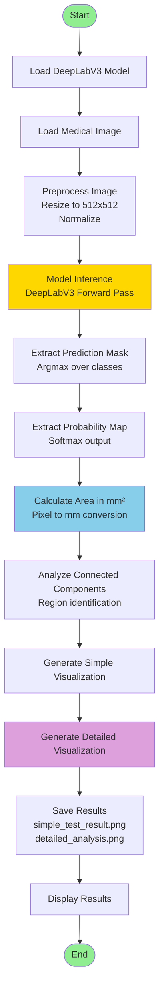
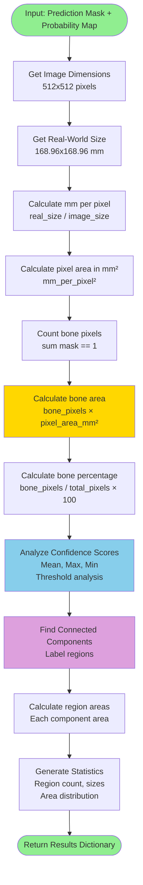
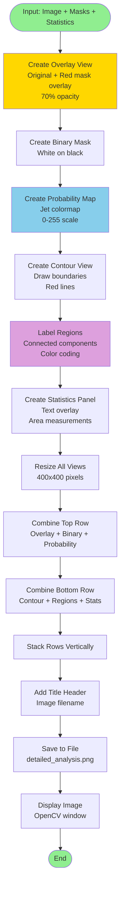

# Bone Death Tissue Segmentation

A medical imaging application for detecting and segmenting bone necrosis (bone death tissue) using deep learning. This project uses DeepLabV3-ResNet50 for semantic segmentation and provides detailed area measurements in mm² along with comprehensive visualizations.

## Features

- **Deep Learning Segmentation**: Uses DeepLabV3-ResNet50 architecture for accurate bone tissue segmentation
- **Area Measurement**: Calculates bone necrosis area in mm² with pixel-to-real-world conversion
- **Confidence Analysis**: Provides probability maps and confidence threshold analysis
- **Region Analysis**: Identifies and analyzes connected components (multiple bone regions)
- **Comprehensive Visualization**: Generates detailed visualizations including overlays, probability maps, contours, and region analysis
- **Interactive Interface**: Easy-to-use batch scripts for Windows users
- **Detailed Statistics**: Outputs extensive statistics including area measurements, confidence scores, and region information

## Architecture Overview

The system consists of three main components:

1. **Model Inference Engine**: Loads pre-trained DeepLabV3-ResNet50 model and performs segmentation
2. **Area Calculation Module**: Converts pixel-based predictions to real-world measurements (mm²)
3. **Visualization Pipeline**: Generates multiple views and combines them into comprehensive analysis images

## Workflow

### Main System Workflow



### Area Calculation Process



### Visualization Pipeline



## Installation

### Prerequisites

- Python 3.8 or higher
- Windows OS (for batch scripts) or any OS with Python support
- CUDA-capable GPU (optional, for faster inference)

### Automatic Installation (Windows)

1. Run the setup script:
   ```bash
   setup.bat
   ```

This will:
- Check Python installation
- Update pip
- Install all required dependencies from `requirements.txt`

### Manual Installation

1. Install Python dependencies:
   ```bash
   pip install -r requirements.txt
   ```

### Required Dependencies

- `torch>=1.9.0` - PyTorch deep learning framework
- `torchvision>=0.10.0` - Computer vision utilities
- `opencv-python>=4.5.0` - Image processing
- `numpy<2.0` - Numerical computations
- `scipy>=1.7.0` - Scientific computing (for connected components)
- `Pillow>=8.0.0` - Image handling

## Usage

### Interactive Mode (Windows)

The easiest way to run the application:

```bash
run_interactive.bat
```

This script will:
1. List available model files (`.pth` files)
2. Let you select a model
3. List available test images in `merged/` folder
4. Let you select an image
5. Run the segmentation and display results

### Command Line Usage

#### Basic Usage (Default Image and Model)
```bash
python simple_test.py
```

#### Specify Image Only
```bash
python simple_test.py path/to/image.jpg
```

#### Specify Both Image and Model
```bash
python simple_test.py path/to/image.jpg path/to/model.pth
```

### Example

```bash
python simple_test.py merged/sag709.jpg DIA1.pth
```

## Code Structure

### Main Functions

#### `test_model(test_image_path, model_path)`
Main function that orchestrates the entire segmentation pipeline.

**Process:**
1. Loads and initializes DeepLabV3-ResNet50 model
2. Loads checkpoint weights
3. Preprocesses input image (resize, normalize)
4. Performs model inference
5. Extracts prediction mask and probability map
6. Calculates area measurements
7. Generates visualizations

#### `calculate_area_mm2(pred_mask, prob_map, image_size, real_size_mm)`
Calculates bone necrosis area in mm² with detailed statistics.

**Parameters:**
- `pred_mask`: Binary prediction mask (0=background, 1=bone)
- `prob_map`: Probability map for bone class
- `image_size`: Image dimensions in pixels (default: 512x512)
- `real_size_mm`: Real-world dimensions in mm (default: 168.96x168.96)

**Returns:**
Dictionary containing:
- `bone_area_mm2`: Total bone area in mm²
- `total_area_mm2`: Total image area in mm²
- `bone_percentage`: Percentage of bone pixels
- `bone_pixels`: Number of bone pixels
- `pixel_area_mm2`: Area of one pixel in mm²

**Features:**
- Pixel-to-mm conversion
- Confidence threshold analysis (0.1, 0.3, 0.5, 0.7, 0.9)
- Connected components analysis
- Region statistics (count, sizes, distribution)

#### `create_simple_visualization(image, pred_mask, prob_map, area_results, test_image)`
Creates a simple 3-panel visualization.

**Output:**
- Left: Original image
- Center: Binary prediction mask
- Right: Probability map (jet colormap)
- Bottom: Statistics panel with key measurements

**Saves:** `simple_test_result.png`

#### `create_detailed_visualization(image, pred_mask, prob_map, area_results, image_path)`
Creates a comprehensive 6-panel visualization.

**Output Panels:**
1. **Overlay**: Original image with red mask overlay (70% opacity)
2. **Binary Mask**: White bone regions on black background
3. **Probability Map**: Confidence scores using jet colormap
4. **Contours**: Original image with red boundary lines
5. **Regions**: Color-coded connected components with area labels
6. **Statistics**: Text panel with detailed measurements

**Saves:** `detailed_analysis.png`

## Output Files

### `simple_test_result.png`
Simple visualization showing:
- Original image (400x400)
- Binary prediction mask (400x400)
- Probability map (400x400)
- Statistics panel with key measurements

### `detailed_analysis.png`
Comprehensive analysis visualization (1200x800) showing:
- 2x3 grid of analysis panels
- Title header with image filename
- Detailed statistics including:
  - Image dimensions
  - Real-world size
  - Bone area in mm²
  - Pixel counts and percentages
  - Confidence score statistics
  - Region analysis

## Technical Details

### Model Architecture

**DeepLabV3-ResNet50**
- Backbone: ResNet-50 (pre-trained on ImageNet)
- Decoder: Atrous Spatial Pyramid Pooling (ASPP)
- Output: 2-class segmentation (background, bone necrosis)
- Input size: 512x512 pixels
- Output size: 512x512 pixels

### Image Preprocessing

1. **Resize**: All images resized to 512x512 pixels
2. **Normalization**: ImageNet mean/std normalization
   - Mean: [0.485, 0.456, 0.406]
   - Std: [0.229, 0.224, 0.225]
3. **Tensor Conversion**: Converted to PyTorch tensor format

### Post-Processing

1. **Mask Extraction**: Argmax over class dimension
2. **Probability Map**: Softmax applied to get class probabilities
3. **Connected Components**: SciPy `ndimage.label` for region identification
4. **Area Conversion**: Pixel count × pixel area (mm²)

### Area Calculation Formula

```
mm_per_pixel = real_size_mm / image_size_pixels
pixel_area_mm2 = mm_per_pixel_width × mm_per_pixel_height
bone_area_mm2 = bone_pixel_count × pixel_area_mm2
```

**Default Values:**
- Image size: 512 × 512 pixels
- Real size: 168.96 × 168.96 mm
- Pixel area: ~0.1089 mm² per pixel

## Model Files

The project includes pre-trained model checkpoints:
- `DIA1.pth`: Model checkpoint 1
- `DIA2.pth`: Model checkpoint 2

These are PyTorch checkpoint files containing:
- Model state dictionary
- Training epoch
- Validation IoU (if available)

## Project Structure

```
Bone_Death_Tissue_Segmentation/
│
├── simple_test.py              # Main script
├── requirements.txt             # Python dependencies
├── setup.bat                    # Windows setup script
├── run_interactive.bat          # Interactive runner script
│
├── DIA1.pth                     # Model checkpoint 1
├── DIA2.pth                     # Model checkpoint 2
│
├── merged/                      # Test images directory
│   └── sag709.jpg              # Example test image
│
├── simple_test_result.png       # Simple visualization output
└── detailed_analysis.png        # Detailed analysis output
```

## Example Output

After running the script, you'll see:

1. **Console Output**:
   - Model loading status
   - Image preprocessing info
   - Area calculation details
   - Confidence statistics
   - Region analysis

2. **Visual Output**:
   - `simple_test_result.png`: Quick overview
   - `detailed_analysis.png`: Comprehensive analysis
   - OpenCV display windows

## Troubleshooting

### Model File Not Found
- Ensure model files (`.pth`) are in the project root directory
- Check file paths if using command-line arguments

### Image Not Found
- Default image path: `merged/sag709.jpg`
- Ensure test images are in the `merged/` folder
- Use absolute paths if needed

### CUDA Out of Memory
- The model will automatically use CPU if CUDA is unavailable
- For large images, consider resizing before processing

### Import Errors
- Run `setup.bat` or `pip install -r requirements.txt`
- Ensure Python version is 3.8+

## License

This project is for medical imaging research purposes. Please ensure proper medical data handling and compliance with healthcare regulations.

## Contributing

Contributions are welcome! Please ensure:
- Code follows existing style
- Tests are added for new features
- Documentation is updated

## Acknowledgments

- DeepLabV3 architecture by Google Research
- PyTorch team for the deep learning framework
- Medical imaging community for dataset contributions

