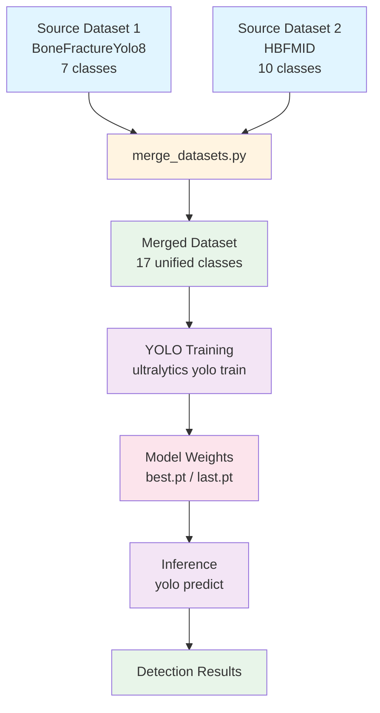

# Bone Fracture Detection with YOLO

A computer vision project for detecting bone fractures in X-ray images using YOLO (You Only Look Once) object detection models. This repository contains datasets, preprocessing scripts, and training pipelines for multi-class bone fracture detection.

## Overview

This project combines two YOLO-formatted datasets to create a unified training dataset with 17 fracture classes:
- **Dataset 1 (BoneFractureYolo8)**: 7 classes focused on anatomical locations (elbow, fingers, forearm, humerus, shoulder, wrist)
- **Dataset 2 (HBFMID)**: 10 classes focused on fracture types (Comminuted, Greenstick, Linear, Oblique, Spiral, Transverse, etc.)

The merged dataset enables training models that can detect both **where** fractures occur and **what type** of fracture is present.

## Project Structure

```
Bone_FractureV2/
├── BoneFractureYolo8/                    # Source dataset 1 (7 classes)
│   ├── data.yaml                         # Dataset configuration (7 classes)
│   ├── train/                            # Training split
│   │   ├── images/                        # X-ray images
│   │   └── labels/                        # YOLO format annotations
│   ├── valid/                            # Validation split
│   └── test/                             # Test split
│
├── Human Bone Fractures Multi-modal Image Dataset (HBFMID)/
│   └── Bone Fractures Detection/         # Source dataset 2 (10 classes)
│       ├── data.yaml                     # Dataset configuration (10 classes)
│       ├── train/                        # Training split
│       ├── valid/                        # Validation split
│       └── test/                         # Test split
│
├── Merged/                               # Unified dataset (17 classes)
│   ├── data.yaml                         # Merged dataset configuration
│   ├── train/                            # Combined training data
│   ├── valid/                            # Combined validation data
│   └── test/                             # Combined test data
│
├── merge_datasets.py                     # Script to merge datasets and remap classes
├── check.py                              # Visualization tool for YOLO annotations
├── fixdata1.py                           # Convert polygon annotations to YOLO boxes
│
├── runs/                                 # Training outputs
│   └── detect/
│       └── train/                        # Training results, metrics, weights
│
├── yolo11n.pt                            # YOLO11 nano pretrained weights
├── yolo12s.pt                            # YOLO12 small pretrained weights
└── bone-final.ipynb                      # Jupyter notebook for exploration
```

## Workflow

The typical workflow from raw datasets to trained model:



## Dataset Format

All datasets use **YOLO format**:
- **Images**: JPG/PNG files in `{split}/images/` directories
- **Labels**: Text files in `{split}/labels/` directories
  - Format: `class_id x_center y_center width height` (normalized 0-1)
  - One line per bounding box
  - Filename matches image (e.g., `image.jpg` → `image.txt`)

### Class Mapping

The merged dataset combines classes as follows:

**Classes 0-6** (from BoneFractureYolo8):
- `elbow positive`, `fingers positive`, `forearm fracture`, `humerus fracture`, `humerus`, `shoulder fracture`, `wrist positive`

**Classes 7-16** (from HBFMID, remapped):
- `Comminuted`, `Greenstick`, `Healthy`, `Linear`, `Oblique Displaced`, `Oblique`, `Segmental`, `Spiral`, `Transverse Displaced`, `Transverse`

## Quick Start

### Prerequisites

- Python 3.8+
- Windows PowerShell (or compatible shell)
- CUDA-capable GPU (recommended for training)

### Installation

1. **Clone the repository**:
   ```powershell
   git clone <repository-url>
   cd Bone_FractureV2
   ```

2. **Create a virtual environment**:
   ```powershell
   python -m venv venv
   .\venv\Scripts\Activate.ps1
   ```

3. **Install dependencies**:
   ```powershell
   pip install ultralytics opencv-python matplotlib numpy
   ```

### Dataset Preparation

1. **Merge datasets** (if not already done):
   ```powershell
   python merge_datasets.py
   ```
   This script:
   - Combines images from both source datasets
   - Remaps class IDs (Dataset 2 classes: 0-9 → 7-16)
   - Detects and skips duplicate images using MD5 hashing
   - Creates `Merged/data.yaml` with unified class definitions

2. **Verify dataset** (optional):
   ```powershell
   python check.py
   ```
   This visualizes bounding boxes on sample images to verify annotations.

### Training

Train a YOLO model using the merged dataset:

```powershell
yolo train data="Merged/data.yaml" model=yolo12s.pt epochs=100 imgsz=640 batch=16
```

**Parameters**:
- `data`: Path to dataset YAML file
- `model`: Pretrained model weights (`yolo11n.pt`, `yolo12s.pt`, or model name)
- `epochs`: Number of training epochs
- `imgsz`: Image size (640 recommended)
- `batch`: Batch size (adjust based on GPU memory)

**Output**: Training results are saved to `runs/detect/train/`:
- `weights/best.pt`: Best model weights
- `weights/last.pt`: Last checkpoint
- `results.png`: Training metrics
- `confusion_matrix.png`: Classification performance

### Inference

Run detection on new images:

```powershell
yolo predict model=runs/detect/train/weights/best.pt source="path/to/images" conf=0.25
```

## Scripts

### `merge_datasets.py`

Merges two YOLO datasets into a unified dataset.

**Usage**:
```powershell
python merge_datasets.py
```

**Features**:
- Preserves original train/valid/test splits
- Remaps class IDs to avoid conflicts
- Detects duplicate images using MD5 hashing
- Generates unified `data.yaml` configuration
- Validates merged dataset and prints statistics

**Output**: Creates `Merged/` directory with combined dataset.

### `check.py`

Visualizes YOLO annotations by drawing bounding boxes on images.

**Usage**:
```powershell
python check.py
```

**Features**:
- Loads images from `BoneFractureYolo8/train/images`
- Reads corresponding label files
- Draws bounding boxes and class IDs
- Displays first 10 images in a grid

**Customization**: Edit paths in the script to visualize different splits or datasets.

### `fixdata1.py`

Converts polygon segmentation annotations to YOLO bounding box format.

**Usage**:
```powershell
python fixdata1.py
```

**Features**:
- Processes label files in `BoneFractureYolo8/`
- Converts polygon coordinates to bounding boxes
- Handles both polygon and existing box formats
- Validates and fixes coordinate ranges

**When to use**: If your source dataset has polygon annotations instead of bounding boxes.

## Git and Data Management

**Important**: This repository only tracks **sample images and labels** to maintain directory structure. Full datasets are excluded via `.gitignore`.

### Tracked Files

Only example files are committed:
- One sample image + label per split per dataset
- Maintains directory structure for easy navigation
- Keeps repository size manageable

### Adding Your Own Data

1. Place your datasets in the appropriate directories:
   - `BoneFractureYolo8/` or `Human Bone Fractures Multi-modal Image Dataset (HBFMID)/Bone Fractures Detection/`
2. Ensure YOLO format (images in `images/`, labels in `labels/`)
3. Run `merge_datasets.py` to combine with existing data
4. Full datasets are automatically ignored by `.gitignore`

### Excluded Directories

The following directories are ignored by git:
- `BoneFractureYolo8/{train,valid,test}/**` (except sample files)
- `Merged/{train,valid,test}/**` (except sample files)
- `Human Bone Fractures Multi-modal Image Dataset (HBFMID)/Bone Fractures Detection/{train,valid,test}/**` (except sample files)

## Model Performance

Training metrics and visualizations are saved to `runs/detect/train/`:
- **Precision/Recall curves**: `BoxP_curve.png`, `BoxR_curve.png`
- **F1 score**: `BoxF1_curve.png`
- **PR curve**: `BoxPR_curve.png`
- **Confusion matrix**: `confusion_matrix.png`
- **Training batches**: `train_batch*.jpg`
- **Validation predictions**: `val_batch*_pred.jpg`

## License

- **BoneFractureYolo8**: CC BY 4.0
- **HBFMID**: Private (check dataset source for usage terms)

## References

- [Ultralytics YOLO Documentation](https://docs.ultralytics.com/)
- [Roboflow Universe](https://universe.roboflow.com/) - Dataset sources
- YOLO models: YOLO11, YOLO12 (Ultralytics)

## Contributing

When contributing:
1. Ensure datasets follow YOLO format
2. Update `data.yaml` if adding new classes
3. Run `merge_datasets.py` to regenerate merged dataset
4. Verify with `check.py` before committing

---

**Note**: This project is for research and educational purposes. Medical image analysis should be performed by qualified professionals.
