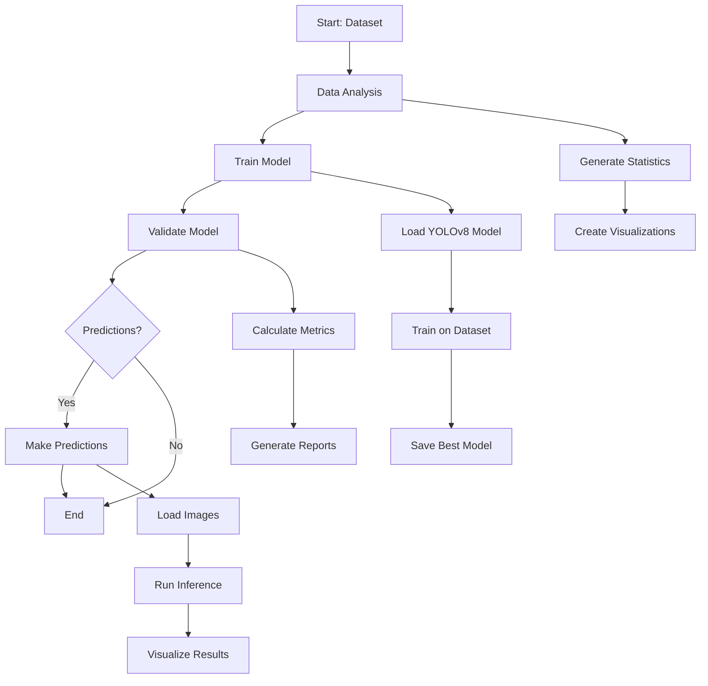
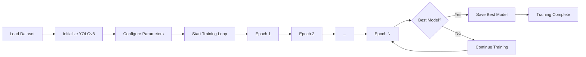
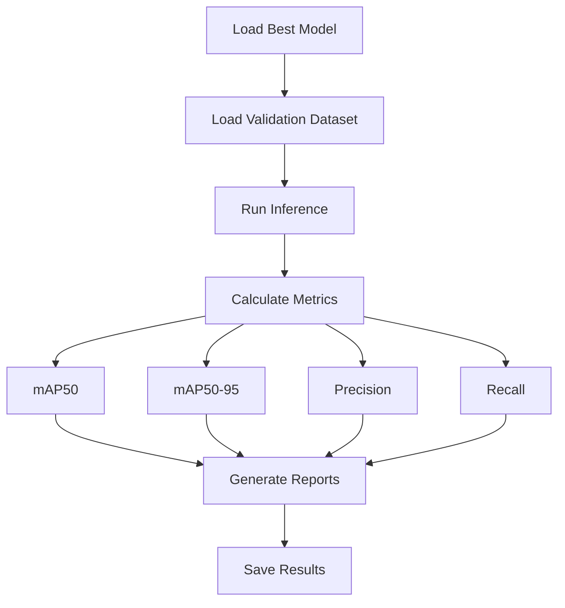
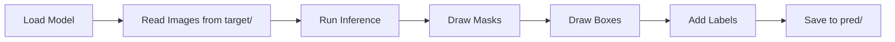

# Bone Fracture Segmentation using YOLOv8

A deep learning project for detecting and segmenting bone fractures in X-ray images using YOLOv8 instance segmentation. This project helps medical professionals identify fractures in various bone regions including elbow, fingers, forearm, humerus, shoulder, and wrist.

## 📋 Table of Contents

- [Overview](#overview)
- [Features](#features)
- [Project Workflow](#project-workflow)
- [Installation](#installation)
- [Dataset Structure](#dataset-structure)
- [Usage](#usage)
- [Project Structure](#project-structure)
- [Output Files](#output-files)
- [Results](#results)

## 🎯 Overview

This project uses YOLOv8-segmentation (YOLOv8-seg) to detect and segment bone fractures in medical X-ray images. The model can identify 7 different classes of bone fractures and healthy bones:

1. **elbow positive** - Fractures in the elbow region
2. **fingers positive** - Fractures in finger bones
3. **forearm fracture** - Fractures in the forearm
4. **humerus fracture** - Fractures in the humerus bone
5. **humerus** - Healthy humerus bone
6. **shoulder fracture** - Fractures in the shoulder region
7. **wrist positive** - Fractures in the wrist area

## ✨ Features

- **Instance Segmentation**: Precise pixel-level fracture detection
- **Multi-class Detection**: Identifies 7 different fracture types
- **Comprehensive Analysis**: Dataset statistics and visualizations
- **Model Validation**: Detailed performance metrics
- **Easy Prediction**: Simple interface for new image predictions
- **Kaggle Support**: Ready-to-use Kaggle notebook script

## 🔄 Project Workflow

The complete workflow from dataset to predictions:



## 📦 Installation

### Prerequisites

- Python 3.8 or higher
- CUDA-capable GPU (recommended for training)

### Step 1: Clone the Repository

```bash
git clone <repository-url>
cd Bone_Fracture_Segmentation
```

### Step 2: Install Dependencies

```bash
pip install ultralytics opencv-python pillow numpy pandas matplotlib seaborn scikit-learn pyyaml
```

Or install from requirements.txt (if available):

```bash
pip install -r requirements.txt
```

### Step 3: Verify Dataset Structure

Ensure your dataset follows this structure:

```
BoneFractureYolo8/
├── data.yaml
├── train/
│   ├── images/
│   └── labels/
├── valid/
│   ├── images/
│   └── labels/
└── test/
    ├── images/
    └── labels/
```

## 📊 Dataset Structure

### Dataset Format

The project uses YOLO format for annotations:
- **Images**: `.jpg` format in `images/` folders
- **Labels**: `.txt` files in `labels/` folders with format: `class_id x_center y_center width height` (normalized 0-1)

### Dataset Configuration

The `data.yaml` file contains:
- Training, validation, and test paths
- Number of classes (7)
- Class names list

### Dataset Statistics

Run the analysis script to see dataset distribution:

```bash
python analysis.py
```

This generates:
- Class distribution charts
- Images per split statistics
- Annotation counts per class
- CSV files with detailed statistics

## 🚀 Usage

### 1. Dataset Analysis

Analyze your dataset before training:

```bash
python analysis.py
```

**What it does:**
- Counts images in train/valid/test splits
- Counts annotations per class
- Generates visualizations (pie charts, bar charts)
- Saves statistics to CSV files

**Output:** `output/analysis/` directory with charts and statistics

### 2. Model Training

Train the YOLOv8 segmentation model:

```bash
python train.py
```

**Training Process:**



**Training Parameters:**
- Model: YOLOv8s-seg (segmentation)
- Epochs: 150
- Image size: 640x640
- Batch size: Auto-determined
- Learning rate: 0.01
- Early stopping: Enabled (patience=50)

**Output:** 
- `output/best.pt` - Best model weights
- `output/last.pt` - Last epoch weights
- `output/training/` - Training plots and logs

### 3. Model Validation

Validate the trained model:

```bash
python validate.py
```

**Validation Process:**



**Metrics Generated:**
- mAP50 (mean Average Precision at IoU=0.5)
- mAP50-95 (mean Average Precision at IoU=0.5:0.95)
- Precision and Recall
- Per-class performance metrics
- Confusion matrix
- Precision-Recall curves

**Output:** `output/validation/` directory with metrics and visualizations

### 4. Making Predictions

Predict fractures on new images:

```bash
python predict.py
```

**Prediction Process:**



**Steps:**
1. Place images in the `target/` directory
2. Run the prediction script
3. Annotated images are saved to `pred/` directory

**Supported Formats:** `.jpg`, `.jpeg`, `.png`, `.bmp`, `.tiff`, `.tif`

**Example:**

```python
# Place your X-ray images in target/ folder
# Then run:
python predict.py

# Results will be in pred/ folder with:
# - Segmentation masks (colored overlays)
# - Bounding boxes
# - Class labels with confidence scores
```

### 5. Kaggle Notebook Training

For Kaggle environment, use the specialized script:

```bash
# In Kaggle notebook:
python KAGGLE.py
```

**Differences from local training:**
- Automatically handles Kaggle paths (`/kaggle/input/`, `/kaggle/working/`)
- Fixes YAML path issues
- Optimized for Kaggle GPU resources
- Saves outputs to Kaggle working directory

## 📁 Project Structure

```
Bone_Fracture_Segmentation/
│
├── README.md                 # This file
├── analysis.py               # Dataset analysis script
├── train.py                 # Model training script
├── validate.py              # Model validation script
├── predict.py               # Prediction script
├── KAGGLE.py                # Kaggle notebook training script
│
├── BoneFractureYolo8/       # Dataset directory
│   ├── data.yaml            # Dataset configuration
│   ├── train/               # Training data
│   │   ├── images/
│   │   └── labels/
│   ├── valid/               # Validation data
│   │   ├── images/
│   │   └── labels/
│   └── test/                # Test data
│       ├── images/
│       └── labels/
│
├── target/                  # Input images for prediction (create this)
├── pred/                    # Prediction outputs (auto-created)
│
└── output/                  # All outputs
    ├── best.pt              # Best trained model
    ├── last.pt              # Last epoch model
    ├── analysis/            # Analysis results
    │   ├── class_distribution_pie.png
    │   ├── annotations_per_class.png
    │   ├── split_statistics.csv
    │   └── class_statistics.csv
    ├── training/            # Training outputs
    │   └── training_results.png
    └── validation/          # Validation outputs
        ├── validation_metrics.json
        ├── confusion_matrix.png
        ├── PR_curve.png
        └── per_class_map.png
```

## 📤 Output Files

### Training Outputs

- **`output/best.pt`**: Best model weights (highest mAP)
- **`output/last.pt`**: Model weights from last epoch
- **`output/training/training_results.png`**: Training curves (loss, mAP, etc.)

### Validation Outputs

- **`output/validation/validation_metrics.json`**: All metrics in JSON format
- **`output/validation/confusion_matrix.png`**: Confusion matrix visualization
- **`output/validation/PR_curve.png`**: Precision-Recall curves
- **`output/validation/per_class_map.png`**: Per-class mAP performance

### Analysis Outputs

- **`output/analysis/class_distribution_pie.png`**: Pie chart of class distribution
- **`output/analysis/annotations_per_class.png`**: Bar chart of annotations per class
- **`output/analysis/split_statistics.csv`**: Dataset split statistics
- **`output/analysis/class_statistics.csv`**: Detailed class statistics

### Prediction Outputs

- **`pred/*.jpg`**: Annotated images with:
  - Colored segmentation masks
  - Bounding boxes
  - Class labels with confidence scores

## 📈 Results

### Understanding Metrics

- **mAP50**: Mean Average Precision at IoU threshold 0.5 (detection accuracy)
- **mAP50-95**: Mean Average Precision averaged over IoU thresholds 0.5 to 0.95 (overall accuracy)
- **Precision**: Percentage of detected fractures that are correct
- **Recall**: Percentage of actual fractures that were detected

### Interpreting Predictions

The prediction script generates images with:
- **Colored masks**: Semi-transparent overlays showing fracture regions
- **Bounding boxes**: Rectangles around detected fractures
- **Labels**: Class name and confidence score (0.00 to 1.00)

Higher confidence scores (closer to 1.00) indicate more certain predictions.

## 🔧 Troubleshooting

### Common Issues

1. **Model not found error**
   - Solution: Train the model first using `python train.py`

2. **Dataset path errors**
   - Solution: Ensure `BoneFractureYolo8/data.yaml` exists and paths are correct

3. **CUDA out of memory**
   - Solution: Reduce batch size in `train.py` or use a smaller model (yolov8n-seg.pt)

4. **No images found in target/**
   - Solution: Create `target/` directory and add images before running `predict.py`

## 📝 License

Dataset License: CC BY 4.0 (from Roboflow)

## 🙏 Acknowledgments

- Dataset provided by Roboflow user
- YOLOv8 by Ultralytics
- Roboflow for dataset hosting

## 📧 Contact & Contributions

For issues, questions, or contributions, please open an issue or pull request on GitHub.

---

**Note**: This project is for educational and research purposes. Always consult medical professionals for actual medical diagnoses.
