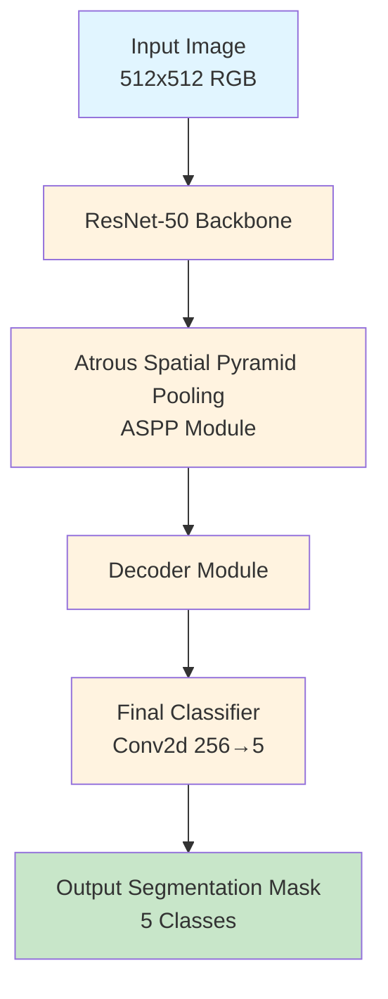
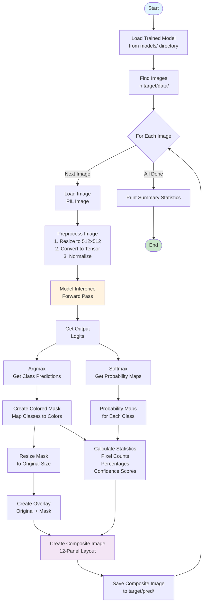
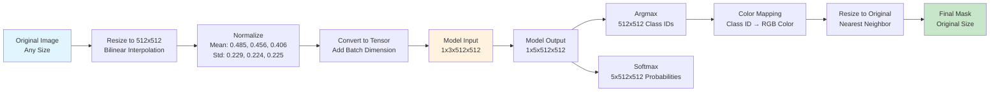

# Tooth Decay Segmentation Project

A deep learning-based semantic segmentation system for detecting and classifying dental conditions in X-ray images using DeepLabV3-ResNet50 architecture.

## 📋 Table of Contents

- [Overview](#overview)
- [Features](#features)
- [Architecture](#architecture)
- [Workflow](#workflow)
- [Installation](#installation)
- [Usage](#usage)
- [Dataset](#dataset)
- [Output Format](#output-format)
- [Technical Details](#technical-details)
- [Project Structure](#project-structure)

## 🎯 Overview

This project performs semantic segmentation on dental X-ray images to identify and classify different dental conditions:

- **Background**: Normal tooth structure
- **Dolgu** (Filling): Dental fillings
- **Kanal** (Root Canal): Root canal treatments
- **Çürük** (Decay): Tooth decay/cavities
- **Protez** (Prosthesis): Dental prosthetics

The system uses a pre-trained DeepLabV3-ResNet50 model fine-tuned on dental X-ray images to provide pixel-level classification with confidence scores.

## ✨ Features

- **5-Class Semantic Segmentation**: Classifies each pixel into one of 5 categories
- **Visual Output**: Generates comprehensive composite visualizations
- **Confidence Maps**: Provides probability maps for each class
- **Statistics**: Calculates pixel-level statistics and percentages
- **Batch Processing**: Processes multiple images automatically
- **GPU Support**: Automatic CUDA detection for faster inference

## 🏗️ Architecture

### Model Architecture

The project uses **DeepLabV3-ResNet50**, a state-of-the-art semantic segmentation architecture:



### Architecture Components

1. **ResNet-50 Backbone**: Extracts multi-scale features from input images
2. **ASPP Module**: Captures context at multiple scales using atrous convolutions
3. **Decoder**: Refines segmentation boundaries
4. **Classifier**: Maps features to 5 class predictions

## 🔄 Workflow

### Main Prediction Pipeline

```mermaid
flowchart LR
    A[Load Image] --> B[Preprocess<br/>Resize to 512x512<br/>Normalize]
    B --> C[Load Model<br/>DeepLabV3-ResNet50]
    C --> D[Model Inference<br/>Forward Pass]
    D --> E[Post-process<br/>Argmax + Softmax]
    E --> F[Create Colored Mask]
    F --> G[Resize to Original Size]
    G --> H[Generate Statistics]
    H --> I[Create Composite Visualization]
    I --> J[Save Output]
    
    style A fill:#e1f5ff
    style J fill:#c8e6c9
    style D fill:#fff3e0
```



### Detailed Processing Flow



### Image Processing Flow



## 📦 Installation

### Requirements

- Python 3.7+
- PyTorch 1.8+
- CUDA (optional, for GPU acceleration)

### Install Dependencies

```bash
pip install torch torchvision
pip install pillow numpy matplotlib tqdm
```

Or install from requirements.txt (if available):

```bash
pip install -r requirements.txt
```

### Directory Structure Setup

Ensure your project has the following structure:

```
Tooth_Decay/
├── models/
│   ├── checkpoint_epoch_280.pth
│   └── checkpoint_epoch_430.pth
├── target/
│   ├── data/          # Input images here
│   └── pred/           # Output images here
├── dataset/
│   ├── images_cut/     # Training images
│   └── tooth_decay coco.json  # Annotations
└── predict.py
```

## 🚀 Usage

### Basic Usage

1. **Place your images** in the `target/data/` directory:
   ```bash
   # Supported formats: .jpg, .jpeg, .png, .bmp, .tiff, .tif
   cp your_image.png target/data/
   ```

2. **Run the prediction script**:
   ```bash
   python predict.py
   ```

3. **View results** in `target/pred/` directory:
   - Each image generates a `{filename}_composite.png` file

### Configuration

You can modify these settings in `predict.py`:

```python
# Image size for model input
IMG_SIZE = (512, 512)

# Input/Output directories
INPUT_DIR = 'target/data'
OUTPUT_DIR = 'target/pred'
MODEL_DIR = 'models'

# Device (automatically detects CUDA)
DEVICE = torch.device('cuda' if torch.cuda.is_available() else 'cpu')
```

### Command Line Output

The script provides:
- Model loading status
- Processing progress bar
- Per-image statistics
- Summary statistics for all images

Example output:
```
============================================================
Tooth Decay Segmentasyon Tahmini
============================================================
Device: cuda
Input Directory: target/data
Output Directory: target/pred
Model Directory: models
============================================================

Model bulundu: checkpoint_epoch_430.pth (245.32 MB)
✓ Model yüklendi: models/checkpoint_epoch_430.pth
  Epoch: 430
  Val IoU: 0.8234

4 görüntü bulundu.

İşleniyor: 1050.png
  Kategori Dağılımı:
    Dolgu      : 12.45% ( 81,920 piksel) - Güven: 0.9234
    Kanal      :  8.32% ( 54,678 piksel) - Güven: 0.8765
    Çürük      :  3.21% ( 21,056 piksel) - Güven: 0.8123
    Protez     :  1.45% (  9,523 piksel) - Güven: 0.7890
  ✓ Composite görüntü kaydedildi: target/pred/1050_composite.png
```

## 📊 Dataset

### Dataset Structure

The dataset follows COCO format:

- **Images**: Located in `dataset/images_cut/`
- **Annotations**: `dataset/tooth_decay coco.json` (COCO format)

### Categories

| ID | Name | Description | Color |
|----|------|-------------|-------|
| 0 | Background | Normal tooth structure | Black |
| 1 | Dolgu | Dental fillings | Red |
| 2 | Kanal | Root canal treatments | Green |
| 3 | Çürük | Tooth decay/cavities | Blue |
| 4 | Protez | Dental prosthetics | Yellow |

### COCO Format

The annotation file contains:
- **images**: Image metadata (id, width, height, filename)
- **annotations**: Segmentation masks (polygon format)
- **categories**: Class definitions

Example annotation structure:
```json
{
  "images": [
    {
      "id": 1,
      "width": 1536,
      "height": 768,
      "file_name": "1016.png"
    }
  ],
  "annotations": [
    {
      "id": 0,
      "image_id": 1,
      "category_id": 1,
      "segmentation": [[x1, y1, x2, y2, ...]],
      "bbox": [x, y, width, height],
      "area": 5559.29
    }
  ],
  "categories": [
    {"id": 1, "name": "Dolgu"},
    {"id": 2, "name": "Kanal"},
    {"id": 3, "name": "Çürük"},
    {"id": 4, "name": "Protez"}
  ]
}
```

## 📤 Output Format

### Composite Image Layout

Each prediction generates a **12-panel composite image**:

```
┌─────────────┬─────────────┬─────────────┬─────────────┐
│  1. Original │  2. Mask    │  3. Overlay │  4. Stats   │
│  (Original)  │  (Original) │  (Original) │             │
├─────────────┼─────────────┼─────────────┼─────────────┤
│  5. Original │  6. Mask    │  7. Overlay │  8. Legend   │
│  (512x512)   │  (512x512)   │  (512x512)  │             │
├─────────────┼─────────────┼─────────────┼─────────────┤
│  9. Dolgu    │ 10. Kanal    │11. Çürük    │12. Distribution│
│  Probability │ Probability  │ Probability │  Bar Chart  │
└─────────────┴─────────────┴─────────────┴─────────────┘
```

### Panel Descriptions

1. **Original Image (Original Size)**: Input image at original resolution
2. **Segmentation Mask (Original Size)**: Colored mask showing all classes
3. **Overlay (Original Size)**: Original image + mask overlay (60% original + 40% mask)
4. **Statistics**: Text display showing:
   - Pixel counts for each category
   - Percentage coverage
   - Average confidence scores

5-7. **Same as 1-3 but at 512x512 resolution** (model input size)

8. **Color Legend**: Visual legend showing category colors

9-11. **Probability Maps**: Heatmaps showing model confidence for:
   - Dolgu (Red colormap)
   - Kanal (Green colormap)
   - Çürük (Blue colormap)

12. **Category Distribution**: Bar chart showing pixel counts per category

### Statistics Output

For each image, the script calculates:
- **Pixel Count**: Number of pixels per category
- **Percentage**: Coverage percentage per category
- **Average Confidence**: Mean probability score for detected pixels

## 🔧 Technical Details

### Model Specifications

- **Architecture**: DeepLabV3-ResNet50
- **Input Size**: 512×512 pixels
- **Output Classes**: 5 (Background + 4 dental conditions)
- **Backbone**: ResNet-50 (ImageNet pre-trained)
- **Output Channels**: 256 → 5 (final classifier)

### Preprocessing

1. **Resize**: Bilinear interpolation to 512×512
2. **Normalization**: ImageNet statistics
   - Mean: [0.485, 0.456, 0.406]
   - Std: [0.229, 0.224, 0.225]
3. **Tensor Conversion**: Convert to PyTorch tensor with batch dimension

### Post-processing

1. **Argmax**: Convert logits to class predictions
2. **Softmax**: Generate probability maps for each class
3. **Color Mapping**: Map class IDs to RGB colors
4. **Resize**: Resize mask to original image size using nearest neighbor

### Color Mapping

```python
CATEGORY_COLORS = {
    0: [0, 0, 0],        # Background - Black
    1: [255, 0, 0],      # Dolgu - Red
    2: [0, 255, 0],      # Kanal - Green
    3: [0, 0, 255],      # Çürük - Blue
    4: [255, 255, 0]     # Protez - Yellow
}
```

### Model Loading

The script automatically:
1. Searches for `best_model.pth` first
2. Falls back to checkpoint files (`checkpoint_epoch_*.pth`)
3. Selects the largest checkpoint file (by size)
4. Handles multiple checkpoint loading methods for compatibility

## 📁 Project Structure

```
Tooth_Decay/
│
├── predict.py                 # Main prediction script
├── README.md                   # This file
│
├── models/                     # Trained model checkpoints
│   ├── checkpoint_epoch_280.pth
│   └── checkpoint_epoch_430.pth
│
├── dataset/                    # Training dataset
│   ├── images_cut/            # Training images
│   │   ├── 1016.png
│   │   ├── 1018.png
│   │   └── ...
│   └── tooth_decay coco.json  # COCO format annotations
│
└── target/                     # Prediction workspace
    ├── data/                  # Input images (place your images here)
    │   ├── 1050.png
    │   ├── 702.png
    │   └── ...
    └── pred/                  # Output predictions
        ├── 1050_composite.png
        ├── 702_composite.png
        └── ...
```

## 🎨 Visualization Example

The composite output provides a comprehensive view of:
- **Original image** at different scales
- **Segmentation results** with color-coded classes
- **Confidence maps** showing model certainty
- **Statistical analysis** of detected conditions

This makes it easy to:
- Verify segmentation quality
- Understand model confidence
- Analyze dental condition distribution
- Compare original vs. segmented images

## 📝 Notes

- The model expects RGB images
- Input images are automatically resized to 512×512 for inference
- Output masks are resized back to original image dimensions
- GPU is automatically used if available (CUDA)
- The script processes all images in the input directory sequentially

## 🔍 Troubleshooting

### Model Not Found
- Ensure model files are in the `models/` directory
- Check file names match expected format: `checkpoint_epoch_*.pth`

### No Images Found
- Verify images are in `target/data/` directory
- Check file extensions are supported (.png, .jpg, etc.)

### CUDA Out of Memory
- Reduce batch size (currently processes one image at a time)
- Use CPU mode: Set `DEVICE = torch.device('cpu')` in predict.py

## 📄 License

[Add your license information here]

## 👥 Contributors

[Add contributor information here]

---

**Last Updated**: 2024

