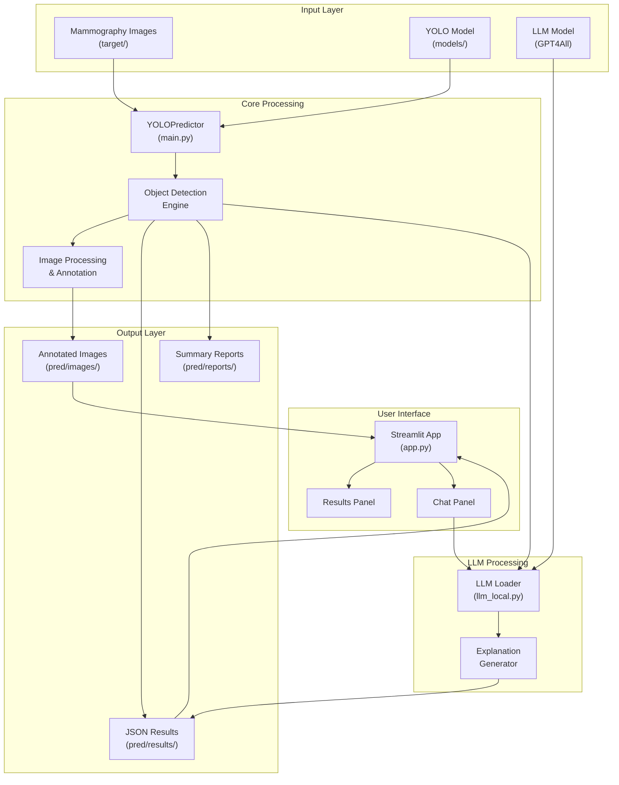
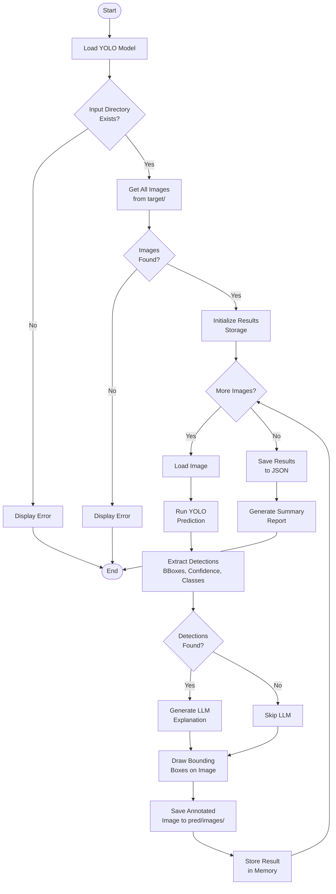
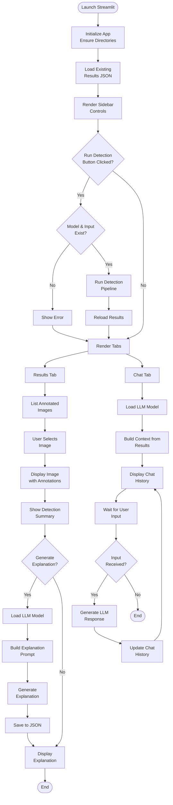
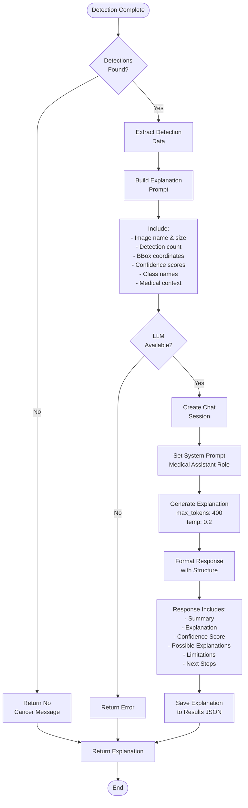
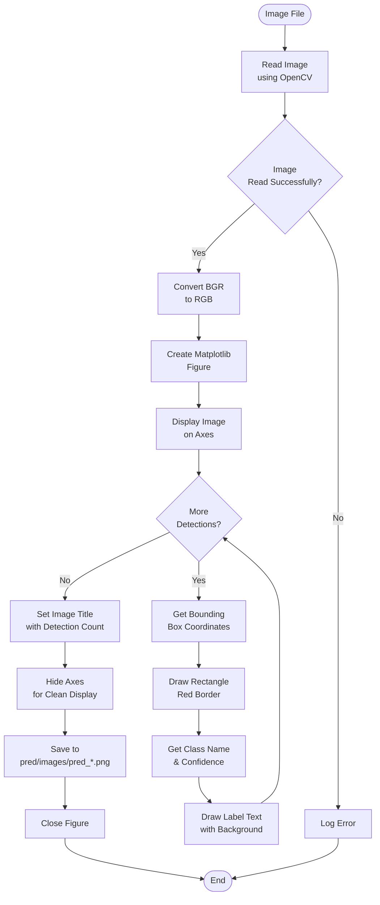
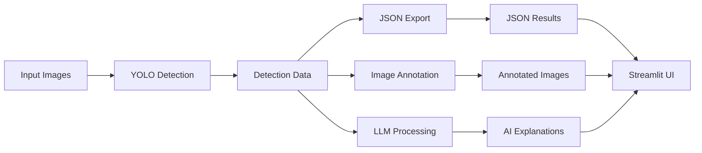

# Breast Cancer Detection System

A comprehensive AI-powered system for detecting breast cancer in mammography images using YOLO (You Only Look Once) object detection and local LLM-powered explanations. The system provides both command-line and web-based interfaces for medical professionals.

## Table of Contents

- [Overview](#overview)
- [Features](#features)
- [System Architecture](#system-architecture)
- [Workflow Diagrams](#workflow-diagrams)
- [Installation](#installation)
- [Usage](#usage)
- [File Structure](#file-structure)
- [Technical Details](#technical-details)
- [Configuration](#configuration)
- [Output Format](#output-format)
- [Troubleshooting](#troubleshooting)

## Overview

This system combines state-of-the-art YOLO object detection with local language model (LLM) capabilities to provide:
- **Automated Detection**: YOLO-based detection of cancer regions in mammography images
- **Visual Annotations**: Bounding boxes and confidence scores overlaid on images
- **AI Explanations**: Natural language explanations of detections using local LLM
- **Interactive Interface**: Streamlit web application for easy interaction
- **Doctor's Assistant**: Chat interface for querying detection results

The system processes mammography images from the `target/` directory and generates annotated images, JSON results, summary reports, and AI-generated explanations.

## Features

- **YOLO Object Detection**: Fast and accurate detection of cancer regions in mammography images
- **Batch Processing**: Process multiple images in a single run
- **Visual Output**: Annotated images with bounding boxes and labels
- **Structured Results**: JSON output with detailed detection metadata
- **AI Explanations**: Local LLM generates human-readable explanations of detections
- **Web Interface**: Streamlit-based UI for easy interaction
- **Doctor's Chat**: Interactive chat interface for querying detection results
- **Summary Reports**: Automated generation of processing statistics and summaries

## System Architecture

The system consists of three main components:

1. **YOLOPredictor** (`main.py`): Core detection engine using YOLO model
2. **Streamlit App** (`app.py`): Web-based user interface
3. **LLM Integration** (`llm_local.py`): Local language model for explanations

### Architecture Diagram



## Workflow Diagrams

### Detection Pipeline Flow



### Streamlit Application Workflow



### LLM Explanation Generation Flow



### Image Processing Flow



## Installation

### Prerequisites

- Python 3.8 or higher
- CUDA-capable GPU (optional, for faster YOLO inference)
- 8GB+ RAM recommended
- Windows/Linux/macOS

### Step 1: Clone the Repository

```bash
git clone <repository-url>
cd Breast_Cancer_GPT
```

### Step 2: Install Python Dependencies

```bash
pip install ultralytics
pip install streamlit
pip install opencv-python
pip install matplotlib
pip install pillow
pip install gpt4all
pip install torch torchvision
```

Or create a `requirements.txt` and install:

```bash
pip install -r requirements.txt
```

### Step 3: Download YOLO Model

Place your trained YOLO model file (`.pt` format) in the `models/` directory:

```
models/
  └── Yolo_Detection_Mamografi_v1.pt
```

### Step 4: Download LLM Model (Optional)

For LLM explanations, download a GPT4All-compatible model (`.gguf` format). The default path is configured in `llm_local.py`:

```
C:\Users\<username>\AppData\Local\nomic.ai\GPT4All\
  └── Meta-Llama-3-8B-Instruct.Q4_0.gguf
```

You can modify `DEFAULT_MODEL_PATH` in `llm_local.py` to point to your model location.

### Step 5: Prepare Input Directory

Create the `target/` directory and place your mammography images there:

```
target/
  ├── image1.png
  ├── image2.png
  └── ...
```

Supported formats: `.jpg`, `.jpeg`, `.png`, `.bmp`, `.tiff`, `.tif`

## Usage

### Command-Line Interface

Run the detection pipeline directly:

```bash
python main.py
```

This will:
1. Load the YOLO model from `models/Yolo_Detection_Mamografi_31.08.2025.pt`
2. Process all images in `target/` directory
3. Save annotated images to `pred/images/`
4. Save JSON results to `pred/results/predictions.json`
5. Generate summary report to `pred/reports/summary_report.txt`
6. Optionally start doctor's assistant chat (if enabled)

### Streamlit Web Interface

Launch the web application:

```bash
streamlit run app.py
```

The app will open in your browser (default: `http://localhost:8501`).

#### Using the Streamlit Interface

1. **Run Detection**:
   - Click "Run detection now" in the sidebar
   - Wait for processing to complete

2. **View Results**:
   - Go to the "Results" tab
   - Select an annotated image from the dropdown
   - View detection summary and statistics
   - Click "Generate explanation for this image" for AI explanation

3. **Chat with Assistant**:
   - Go to the "Chat" tab
   - Ask questions about the detection results
   - The assistant uses context from all detections

### Configuration

#### Model Paths

Edit `main.py` to change model path:

```python
MODEL_PATH = os.path.join("models", "your_model.pt")
```

Edit `app.py` to change default model:

```python
DEFAULT_MODEL_NAME = "your_model_name"
DEFAULT_MODEL_PATH = MODELS_DIR / DEFAULT_MODEL_NAME
```

#### LLM Configuration

Edit `llm_local.py` to change LLM model path:

```python
DEFAULT_MODEL_PATH = r"path\to\your\model.gguf"
```

#### Directory Paths

- **Input**: `target/` (configurable in `YOLOPredictor.__init__`)
- **Output**: `pred/` (configurable in `YOLOPredictor.__init__`)
  - `pred/images/` - Annotated images
  - `pred/results/` - JSON results
  - `pred/reports/` - Summary reports

## File Structure

```
Breast_Cancer_GPT/
│
├── main.py                 # Core YOLO detection pipeline
├── app.py                  # Streamlit web application
├── llm_local.py           # Local LLM integration (GPT4All)
│
├── models/                 # YOLO model files
│   └── Yolo_Detection_Mamografi_v1.pt
│
├── target/                 # Input images directory
│   ├── 1.png
│   ├── 2.png
│   └── ...
│
└── pred/                   # Output directory
    ├── images/             # Annotated images with bounding boxes
    │   ├── pred_1.png
    │   └── ...
    ├── results/            # JSON results
    │   └── predictions.json
    └── reports/            # Summary reports
        └── summary_report.txt
```

## Technical Details

### YOLOPredictor Class

The `YOLOPredictor` class (`main.py`) is the core detection engine:

**Key Methods**:
- `__init__()`: Initialize model and directories
- `get_image_files()`: Scan input directory for images
- `predict_single_image()`: Run YOLO detection on one image
- `save_prediction_image()`: Draw bounding boxes and save annotated image
- `process_all_images()`: Batch process all images
- `save_results_json()`: Export results to JSON
- `generate_summary_report()`: Create text summary report
- `run_complete_pipeline()`: Execute full pipeline

**Detection Output Format**:
```python
{
    'bbox': [x1, y1, x2, y2],      # Bounding box coordinates
    'confidence': 0.85,             # Detection confidence (0-1)
    'class_id': 0,                  # Class ID
    'class_name': 'cancer'          # Class name
}
```

### Streamlit Application

The Streamlit app (`app.py`) provides:

**Components**:
- `ui_sidebar()`: Control panel with detection trigger
- `run_detection_pipeline()`: Execute detection from UI
- `render_results_panel()`: Display images and explanations
- `render_chat_panel()`: Interactive chat interface
- `build_context_from_results()`: Create LLM context from detections
- `build_explanation_prompt_from_record()`: Build explanation prompts

**Session State**:
- `chat_history`: Stores chat conversation
- Cached LLM model for performance

### LLM Integration

The LLM module (`llm_local.py`) handles:

**Features**:
- Model loading with GPU/CPU fallback
- Chat session management
- Streaming and non-streaming generation
- Device priority: GPU → Kompute → CPU

**Explanation Generation**:
- Input: Detection results with bounding boxes and confidence
- Output: Structured explanation with:
  - Summary
  - Plain-language explanation
  - Confidence assessment
  - Possible explanations
  - Model limitations
  - Recommended next steps

### Data Flow



## Output Format

### JSON Results Structure

```json
{
  "model_path": "models/Yolo_Detection_Mamografi_v1.pt",
  "input_directory": "target",
  "output_directory": "pred",
  "processing_date": "2025-11-07T22:03:24.370338",
  "total_images_processed": 6,
  "results": [
    {
      "image_name": "2.png",
      "image_path": "target/2.png",
      "total_detections": 1,
      "detections": [
        {
          "bbox": [1989.08, 2061.44, 2323.07, 2326.35],
          "confidence": 0.41,
          "class_id": 0,
          "class_name": "cancer"
        }
      ],
      "processing_time": 62.99,
      "image_size": {
        "width": 2364,
        "height": 2964
      },
      "llm_explanation": "**Summary:**\n\nThe algorithm detected..."
    }
  ]
}
```

### Summary Report Format

```
YOLO PREDICTION SUMMARY REPORT
==================================================
Processing Date: 2025-11-07 22:03:24
Model: models\Yolo_Detection_Mamografi_v1.pt
Input Directory: target
Output Directory: pred

PROCESSING STATISTICS
------------------------------
Total Images: 6
Successfully Processed: 6
Failed: 0
Success Rate: 100.0%

DETECTION STATISTICS
------------------------------
Total Detections: 4
Average Detections per Image: 0.67

DETECTIONS BY CLASS
------------------------------
cancer: 4
```

## Troubleshooting

### Model Not Found

**Error**: `Model not found: models/your_model.pt`

**Solution**:
- Ensure model file exists in `models/` directory
- Check file name matches configuration
- Verify file permissions

### LLM Not Available

**Error**: `LLM unavailable` or `gpt4all not installed`

**Solution**:
```bash
pip install gpt4all
```
- Verify LLM model path in `llm_local.py`
- Check model file exists and is valid `.gguf` format
- System will work without LLM (explanations disabled)

### No Images Found

**Error**: `No image files found!`

**Solution**:
- Ensure `target/` directory exists
- Place images in `target/` directory
- Check supported formats: `.jpg`, `.jpeg`, `.png`, `.bmp`, `.tiff`, `.tif`
- Verify file permissions

### GPU/CUDA Issues

**Error**: CUDA out of memory or GPU not detected

**Solution**:
- YOLO will automatically fall back to CPU
- Reduce batch size if processing multiple images
- Close other GPU-intensive applications
- For LLM: Set `GPT4ALL_DEVICE=cpu` environment variable

### Streamlit Port Already in Use

**Error**: `Port 8501 is already in use`

**Solution**:
```bash
streamlit run app.py --server.port 8502
```

### Import Errors

**Error**: `ModuleNotFoundError`

**Solution**:
```bash
pip install -r requirements.txt
# Or install individually:
pip install ultralytics streamlit opencv-python matplotlib pillow gpt4all torch
```

### Low Detection Confidence

**Issue**: Detections have very low confidence scores

**Solution**:
- This is normal - model outputs all detections above threshold
- Filter results by confidence in post-processing if needed
- Review model training data and retrain if necessary
- Check image quality and preprocessing

## License

[Specify your license here]

## Contributing

[Contributing guidelines if applicable]

## Acknowledgments

- YOLO by Ultralytics
- GPT4All for local LLM capabilities
- Streamlit for web interface framework

